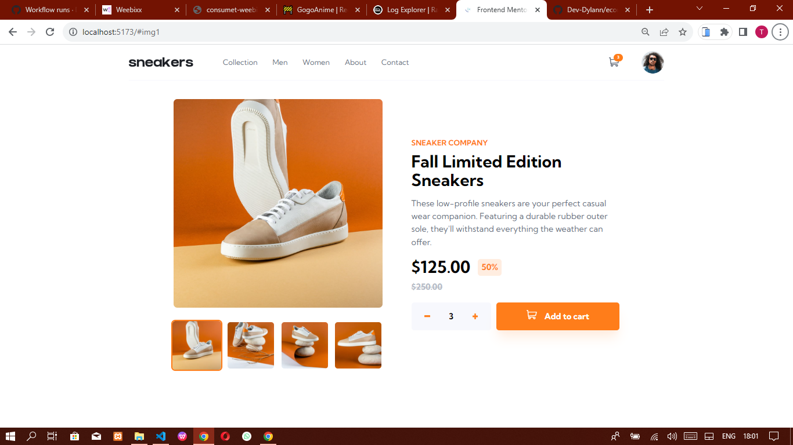

# Frontend Mentor - E-commerce product page solution

This is a solution to the [E-commerce product page challenge on Frontend Mentor](https://www.frontendmentor.io/challenges/ecommerce-product-page-UPsZ9MJp6). Frontend Mentor challenges help you improve your coding skills by building realistic projects.

## Table of contents

- [Overview](#overview)
  - [The challenge](#the-challenge)
  - [Screenshot](#screenshot)
  - [Links](#links)
- [My process](#my-process)
  - [Built with](#built-with)
  - [What I learned](#what-i-learned)
- [Author](#author)

## Overview

### The challenge

Users should be able to:

- View the optimal layout for the site depending on their device's screen size
- See hover states for all interactive elements on the page
- Open a lightbox gallery by clicking on the large product image
- Switch the large product image by clicking on the small thumbnail images
- Add items to the cart
- View the cart and remove items from it

### Screenshot

### Links

- Solution URL: [View Solution](https://www.frontendmentor.io/solutions/ecommerce-product-page-built-with-typescript-and-react-cR42zrrQxW)
- Live Site URL: [View Live](https://devdylann-ecommerce-product-page.netlify.app)

## My process

### Built with

- Mobile-first workflow
- [Tailwind CSS](https://tailwindcss.com/) - CSS Framework
- [Typescript](https://www.typescriptlang.org/)
- [Vite](https://vitejs.dev/) + [React](https://reactjs.org/)
- Font from [Google Fonts](https://fonts.google.com/)

### What I learned

Learnt how to use React's Context API properly with Typescript.

## Author

- Frontend Mentor - [@DevDylan](https://www.frontendmentor.io/profile/Dev-Dylann)
- Twitter - [@DevDylan](https://twitter.com/TunmiseTubi)
